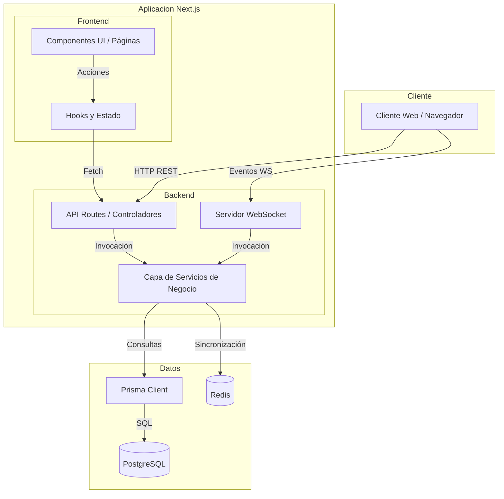
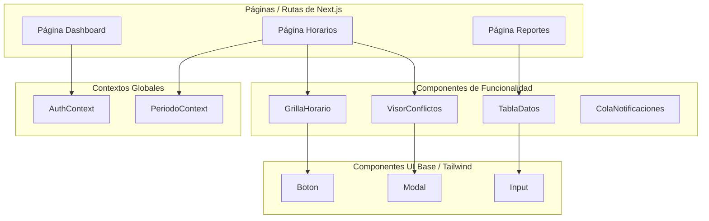
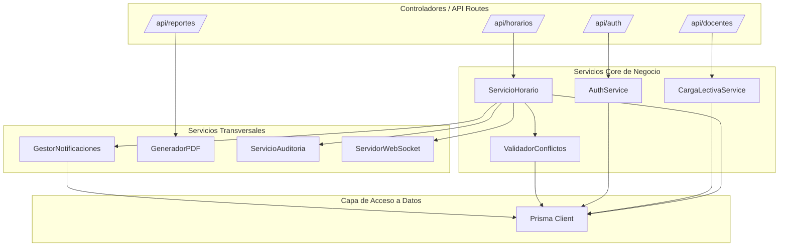

# Estructura de Componentes del Sistema E-PROJECT

Los diagramas presentados a continuación representan la arquitectura de componentes del sistema E-PROJECT. **Sí, son los diagramas correctos e indicados** porque reflejan de forma precisa la separación de responsabilidades, la alta cohesión y el bajo acoplamiento que provee el framework Next.js (App Router) tanto en el cliente (Frontend) como en el servidor (Backend).

## 1. Diagrama de Componentes a Nivel de Sistema (Alto Nivel)

**Explicación:**
Este diagrama muestra los grandes bloques funcionales (macro-componentes) del sistema completo y cómo se comunican a través de interfaces bien definidas. Es la representación ideal para entender la topología del sistema.
- **Cliente Web:** El punto de entrada para los usuarios (navegador).
- **Frontend App (Next.js React):** Renderiza las interfaces gráficas, maneja el estado del lado del cliente y realiza peticiones asíncronas.
- **Backend API (Next.js Routes):** Actúa como middleware; recibe las solicitudes HTTP del frontend y valida la seguridad/autenticación.
- **Capa de Servicios:** Contiene toda la lógica de negocio pura y pesada.
- **Infraestructura de Datos:** Prisma ORM, PostgreSQL y Redis, que son los encargados de la persistencia de datos y la caché.
- **WebSocket Server:** Maneja la comunicación bidireccional en tiempo real (esencial para bloquear horarios simultáneamente entre varios docentes).

## 2. Diagrama de Componentes del Frontend

**Explicación:**
Este diagrama detalla cómo se organizan internamente los componentes de la interfaz de usuario en React. Es la arquitectura correcta porque sigue el patrón de separación entre componentes "Smart" o Contenedores (Páginas y Contextos que manejan estado) y componentes "Dumb" o Presentacionales (UI base reutilizable).
- **Páginas (src/app):** Componentes raíz de cada ruta (Dashboard, Horarios, Reportes). Son el punto de orquestación.
- **Proveedores de Contexto:** Proveen datos y estado global a toda la app sin necesidad de pasarlos por `props` (Sesión, Temas, Estado del Periodo actual).
- **Componentes de Funcionalidad:** Encapsulan lógica específica y pesada de una vista (ej. Grilla de Horarios interactiva, Tabla de Usuarios, Colas de Notificaciones).
- **Componentes UI Base:** Elementos atómicos, aislados y reutilizables creados típicamente con Tailwind (Botones, Modales, Inputs).

## 3. Diagrama de Componentes del Backend (Servicios)

**Explicación:**
En el backend, la arquitectura de componentes está regida por un patrón clásico de "Arquitectura de Servicios por Capas". Es el enfoque más profesional y correcto porque permite que las **API Routes** sirvan únicamente como controladores de tráfico (validan inputs y tokens), delegando el procesamiento real a módulos especializados (**Servicios**). Esto hace que el código sea escalable, testeable unitariamente y fácil de mantener.
- **API Controllers:** Rutas en `src/app/api` que exponen los endpoints REST.
- **Servicios Core:** Servicios centrales como la asignación de horarios, validación de conflictos o cálculo de carga lectiva.
- **Servicios Transversales (Auxiliares):** Servicios de propósito general utilizados por todo el sistema, como notificaciones por correo/WhatsApp, generación de archivos PDF o registros de auditoría.
- **Capa de Acceso a Datos (Prisma):** El componente único encargado de traducir la lógica de los servicios en consultas SQL seguras para la base de datos.

