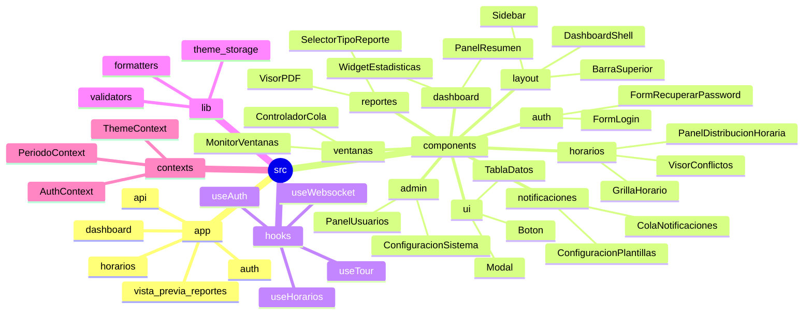

# Estructura de Componentes del Sistema E-PROJECT

Este documento desglosa visualmente la organización de los componentes del frontend y los módulos de servicio del backend del sistema E-PROJECT.

## 1. Mapa de Directorios y Componentes Frontend

**Explicación:** Aquí se desglosa visualmente la estructura interna del código fuente del lado del cliente (`src/app` y `src/components`). Detalla cómo se agrupan funcionalmente los componentes de React, enrutamiento, hooks y contextos de la aplicación. Es útil para entender la jerarquía del frontend y la modularización de la interfaz, como los paneles de administración, herramientas de reportes y las grillas de horarios interactivas.

## 2. Arquitectura Detallada de la Capa de Servicios (Backend)

**Explicación:** Este grafo detalla los dominios lógicos que conforman la capa de negocio del sistema, ubicados en `src/services`. La arquitectura basada en servicios permite aislar la lógica compleja (como el motor de asignación de horarios, validación de conflictos, y gestión de carga lectiva) de los controladores web (API Routes). Esto fomenta la reutilización del código, el testing modular y la escalabilidad de cada área.

```mermaid
graph LR
    subgraph "Capa de Servicios (src/services)"
        Auth[Auth]
        Auth --> AuthService
        Auth --> SesionService
        Auth --> TokenService
        
        Horarios[Horarios]
        Horarios --> ServicioHorario
        Horarios --> GestorDisponibilidad
        Horarios --> ValidadorConflictos
        Horarios --> MotorAsignacion
        
        Carga[Carga Académica]
        Carga --> CargaLectivaService
        Carga --> CargaNoLectivaService
        
        Ventanas[Ventanas Atención]
        Ventanas --> GestorVentanasAtencion
        Ventanas --> TemporizadorService
        Ventanas --> ControladorColaDocentes
        
        Reportes[Reportes y PDF]
        Reportes --> GeneradorPDF
        Reportes --> ReporteHorariosConfirmados
        Reportes --> ReporteCargaDocente
        
        Notif[Notificaciones]
        Notif --> GestorNotificaciones
        Notif --> ServicioWhatsApp
        Notif --> ServicioTelegram
        Notif --> ServicioCorreo
        
        Estadisticas[Estadísticas]
        Estadisticas --> GeneradorGraficos
        Estadisticas --> CalculadorEstadisticas
        
        WS[WebSocket]
        WS --> ServidorWebSocket
        WS --> CanalDisponibilidad
        WS --> CanalNotificaciones
    end
```

