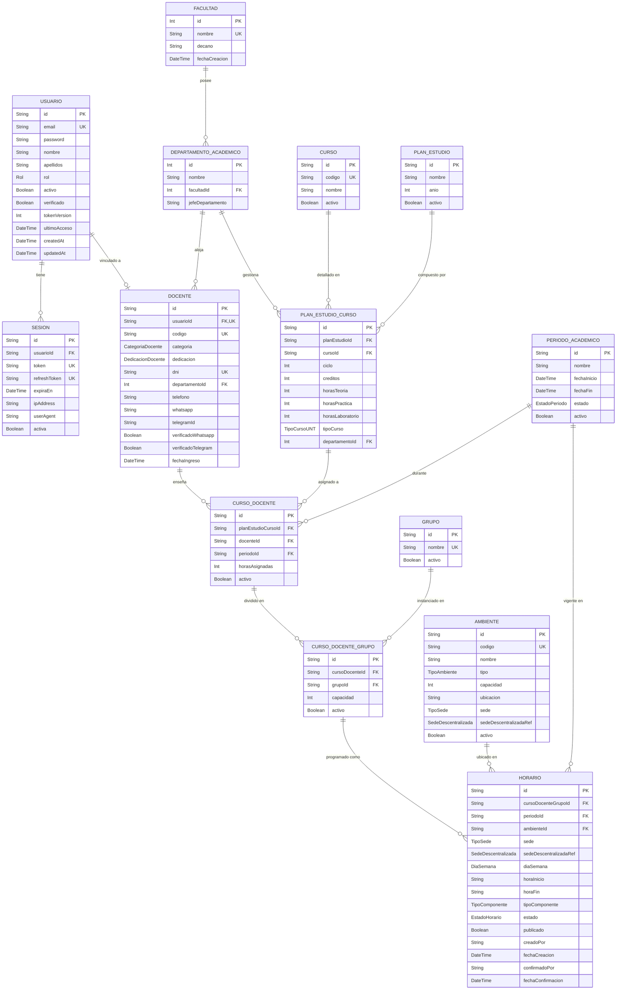

# Modelo de Datos del Sistema E-PROJECT

Este documento detalla el esquema de base de datos relacional (Prisma) utilizado en el sistema, mostrando absolutamente todas las entidades, atributos y relaciones divididas en dos grandes áreas.

## 1. Core Académico

**Explicación:** Este primer diagrama entidad-relación modela el núcleo de las operaciones universitarias de la plataforma. Define todas las entidades principales, atributos y restricciones (como llaves foráneas y primarias) necesarias para manejar facultades, departamentos académicos, planes de estudio, docentes, cursos, grupos, ambientes (aulas/laboratorios) y la entidad central de `HORARIO`.

## 2. Administrativo, Validaciones y Auditoría

**Explicación:** Este segundo diagrama abarca toda la información auxiliar, de cumplimiento y auditoría. Mapea cómo el sistema registra la carga docente no lectiva, comisiones de servicio, disponibilidad de docentes, incidencias (incumplimientos de los horarios), sistema de colas y turnos virtuales (ventanas de atención), envíos de notificaciones multicanal, y los registros exhaustivos de auditoría de actividad dentro del sistema.

```mermaid
erDiagram
    CARGO_ADMINISTRATIVO {
        String id PK
        String docenteId FK
        TipoCargoAdministrativo tipoCargo
        DateTime fechaInicio
        DateTime fechaFin
        Boolean activo
        String resolucion
        String observaciones
    }

    BECA_DOCENTE {
        String id PK
        String docenteId FK
        TipoBeca tipoBeca
        DateTime fechaInicio
        DateTime fechaFin
        String institucion
        String resolucion
        Boolean activo
    }

    COMISION_SERVICIO {
        String id PK
        String docenteId FK
        SedeDescentralizada sedeDestino
        DateTime fechaInicio
        DateTime fechaFin
        String licenciaDocumento
        String docenteReemplazoId FK
        Boolean activo
    }

    DECLARACION_NO_LECTIVA {
        String id PK
        String docenteId FK
        String periodoId FK
        DateTime fechaDeclaracion
        Int totalHoras
        String observaciones
    }

    DECLARACION_NO_LECTIVA_ITEM {
        String id PK
        String declaracionId FK
        TipoActividadNoLectiva tipoActividad
        Int horasSemanales
        String descripcion
        Json metadata
    }

    DISPONIBILIDAD_DOCENTE {
        String id PK
        String docenteId FK
        DiaSemana diaSemana
        String horaInicio
        String horaFin
        Int prioridad
    }

    RESTRICCION_AMBIENTE {
        String id PK
        String ambienteId FK
        DiaSemana diaSemana
        String horaInicio
        String horaFin
        String motivo
    }

    VALIDACION_HORARIO {
        String id PK
        String horarioId FK
        TipoReglaValidacion tipoRegla
        Boolean cumple
        String mensaje
        Json metadata
    }

    INCUMPLIMIENTO {
        String id PK
        String docenteId FK
        String horarioId FK
        TipoReglaValidacion tipoRegla
        String descripcion
        EstadoIncumplimiento estado
        String detectadoPor
        String sancionAplicada
        String resolucion
    }

    VENTANA_ATENCION {
        String id PK
        String periodoId FK
        String nombre
        Json categorias
        DateTime fechaInicio
        DateTime fechaFin
        EstadoVentana estado
    }

    ATENCION_VENTANA {
        String id PK
        String ventanaId FK
        String docenteId FK
        Int posicion
        EstadoAtencion estado
        DateTime horaInicio
        DateTime horaFin
    }

    NOTIFICACION {
        String id PK
        String usuarioId FK
        TipoNotificacion tipo
        String titulo
        String mensaje
        PrioridadNotificacion prioridad
        CanalNotificacion canal
        EstadoNotificacion estado
        Json metadata
    }

    ENVIO_NOTIFICACION {
        String id PK
        String notificacionId FK
        CanalNotificacion canal
        EstadoNotificacion estado
        Int intento
        String error
        DateTime enviadoEn
    }

    PREFERENCIAS_NOTIFICACION {
        String id PK
        String docenteId FK, UK
        Boolean correoActivo
        Boolean whatsappActivo
        Boolean telegramActivo
        Boolean sistemaActivo
        Int frecuenciaMaxDiaria
    }

    REGISTRO_AUDITORIA {
        String id PK
        String usuarioId FK
        String accion
        String entidad
        String entidadId
        Json datos
        String ipAddress
        DateTime createdAt
    }

    CONFIGURACION_PERIODO {
        String id PK
        String periodoId FK, UK
        Int horasMaxDiariasDocente
        Int horasMaxContinuas
        Int descansoMinEntreHoras
        Json ordenCategorias
    }

    CHAT_SESION {
        String id PK
        String usuarioId FK
        String titulo
    }

    CHAT_MENSAJE {
        String id PK
        String sesionId FK
        String role
        String contenido
    }

    DOCENTE ||--o{ CARGO_ADMINISTRATIVO : "ocupa"
    DOCENTE ||--o{ BECA_DOCENTE : "obtiene"
    DOCENTE ||--o{ COMISION_SERVICIO : "es comisionado a"
    DOCENTE ||--o{ DECLARACION_NO_LECTIVA : "realiza"
    DECLARACION_NO_LECTIVA ||--o{ DECLARACION_NO_LECTIVA_ITEM : "contiene"
    DOCENTE ||--o{ DISPONIBILIDAD_DOCENTE : "informa"
    AMBIENTE ||--o{ RESTRICCION_AMBIENTE : "bloqueado por"
    HORARIO ||--o{ VALIDACION_HORARIO : "sujeto a"
    DOCENTE ||--o{ INCUMPLIMIENTO : "infringe"
    HORARIO ||--o{ INCUMPLIMIENTO : "relacionado a"
    PERIODO_ACADEMICO ||--o{ VENTANA_ATENCION : "abre"
    VENTANA_ATENCION ||--o{ ATENCION_VENTANA : "organiza turnos de"
    DOCENTE ||--o{ ATENCION_VENTANA : "recibe turno"
    USUARIO ||--o{ NOTIFICACION : "recibe"
    NOTIFICACION ||--o{ ENVIO_NOTIFICACION : "ejecuta a través de"
    DOCENTE ||--o| PREFERENCIAS_NOTIFICACION : "configura"
    USUARIO ||--o{ REGISTRO_AUDITORIA : "registra"
    PERIODO_ACADEMICO ||--o| CONFIGURACION_PERIODO : "estipula"

    USUARIO ||--o{ CHAT_SESION : "conversa en"
    CHAT_SESION ||--o{ CHAT_MENSAJE : "contiene"
```

